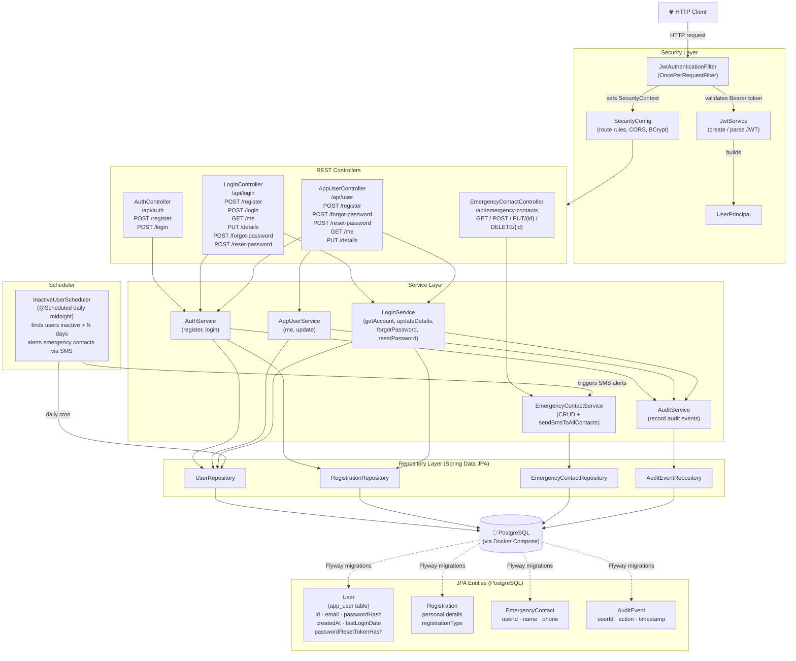

# Checkin — Architecture Diagram

## Tech Stack

| Layer | Technology |
|---|---|
| Framework | Spring Boot 3.4 (Java 17) |
| Security | Spring Security + JWT (jjwt 0.12) |
| Persistence | Spring Data JPA + Flyway + PostgreSQL |
| Scheduling | Spring Scheduler |
| Build | Gradle |
| Infra | Docker Compose |

---

## Component Diagram



---

## Package Structure

```
com.checkin
├── CheckinApplication            ← Spring Boot entry point
├── audit/
│   └── AuditAction                ← Enum (LOGIN, UPDATE_DETAILS, …)
├── config/
│   ├── EmergencyContactProperties ← @ConfigurationProperties
│   ├── JwtProperties              ← JWT secret / expiry
│   └── SecurityConfig             ← Filter chain, BCrypt, CORS
├── controller/
│   ├── AppUserController          ← /api/user/*
│   ├── AuthController             ← /api/auth/*
│   ├── EmergencyContactController ← /api/emergency-contacts/*
│   └── LoginController            ← /api/login/*
├── dto/                           ← Request/Response POJOs (13 DTOs)
├── model/
│   ├── AuditEvent
│   ├── EmergencyContact
│   ├── Registration
│   └── User
├── repository/                    ← JpaRepository interfaces (4)
├── scheduler/
│   └── InactiveUserScheduler      ← Daily inactive-user check
├── security/
│   ├── JwtAuthenticationFilter
│   ├── JwtService
│   └── UserPrincipal
└── service/
    ├── AppUserService
    ├── AuditService
    ├── AuthService
    ├── EmergencyContactService
    └── LoginService
```

---

## Key Flows

### 1. Registration
`POST /api/auth/register` → `AuthService.register` → saves `User` + `Registration` → returns `UserResponse`

### 2. Login
`POST /api/auth/login` → `AuthService.login` → validates password → records `AuditEvent(LOGIN)` → returns JWT in `AuthResponse`

### 3. Authenticated Request
`Bearer <token>` → `JwtAuthenticationFilter` → `JwtService.parseAndValidate` → populates `SecurityContext` with `UserPrincipal` → controller extracts `userId`

### 4. Password Reset
`POST /forgot-password` → `LoginService.forgotPassword` → stores hashed reset token on `User` → returns token  
`POST /reset-password` → `LoginService.resetPassword` → validates token + expiry → updates `passwordHash`

### 5. Inactive-User Alerting (Scheduler)
Daily at midnight → `InactiveUserScheduler` → queries users with `lastLoginDate` older than N days → calls `EmergencyContactService.sendSmsToAllContacts` for each
