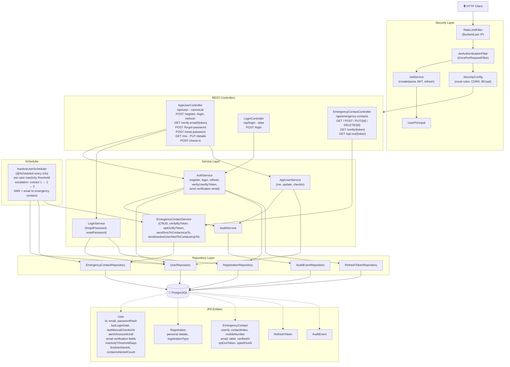

# Checkin — Architecture Diagram

## Tech Stack

| Layer | Technology |
|---|---|
| Framework | Spring Boot 3.4 (Java 17) |
| Security | Spring Security + JWT (jjwt 0.12) + refresh tokens |
| Persistence | Spring Data JPA + Flyway + PostgreSQL |
| Scheduling | Spring Scheduler |
| Email | Spring Mail + MailHog (dev) / SMTP (prod) |
| Rate limiting | Bucket4j |
| Build | Gradle |
| Infra | Docker Compose |

**Context path:** `/checkin` — all APIs are under `http://host:port/checkin/api/...`

---

## Component Diagram



---

## Package Structure

```
com.checkin
├── CheckinApplication
├── audit/
│   └── AuditAction                 ← LOGIN, CHECK_IN, UPDATE_DETAILS, …
├── config/
│   ├── AppMetrics                  ← Micrometer counters/timers
│   ├── EmailProperties             ← app.emergency-contacts.email
│   ├── EmergencyContactLimitProperties
│   ├── EmergencyContactProperties  ← SMS/email enabled
│   ├── JwtProperties
│   ├── MdcFilter                   ← Request ID, userId in MDC
│   ├── RateLimitFilter             ← Bucket4j on auth paths
│   ├── RateLimitProperties
│   ├── SecurityConfig
│   ├── UserVerificationProperties  ← app.user (email verification)
│   └── WebMvcConfig                ← UserPrincipalArgumentResolver
├── controller/
│   ├── AppUserController           ← /api/user/* (canonical)
│   ├── EmergencyContactController  ← /api/emergency-contacts/*
│   └── LoginController             ← /api/login (alias for login only)
├── dto/                            ← Request/Response POJOs
├── exception/
│   └── GlobalExceptionHandler
├── model/
│   ├── AuditEvent
│   ├── EmergencyContact
│   ├── Registration
│   ├── RefreshToken
│   └── User
├── repository/                     ← UserRepository, RegistrationRepository,
│                                    EmergencyContactRepository, RefreshTokenRepository,
│                                    AuditEventRepository
├── scheduler/
│   └── InactiveUserScheduler       ← Every 10s, per-user threshold, escalation
├── security/
│   ├── CurrentUser
│   ├── JwtAuthenticationFilter
│   ├── JwtService
│   ├── UserPrincipal
│   └── UserPrincipalArgumentResolver
└── service/
    ├── AppUserService
    ├── AuditService
    ├── AuthService
    ├── EmergencyContactService
    ├── EmergencyContactVerificationTemplate
    ├── InactiveUserEmailTemplate
    ├── LoginService
    ├── UserVerificationTemplate
    └── (templates in resources/templates/*.peb)
```

---

## API Overview (canonical: `/api/user`)

| Endpoint | Auth | Description |
|----------|------|-------------|
| `POST /api/user/register` | No | Register; sends verification email if enabled |
| `POST /api/user/login` | No | Login; requires verified email when enabled |
| `POST /api/user/refresh` | No | Refresh access token |
| `GET /api/user/verify-email/{token}` | No | Verify user email (from registration email) |
| `POST /api/user/forgot-password` | No | Request password reset |
| `POST /api/user/reset-password` | No | Reset password with token |
| `GET /api/user/me` | Yes | Current user details + inactivityThresholdDays |
| `PUT /api/user/details` | Yes | Update email, inactivityThresholdDays |
| `POST /api/user/check-in` | Yes | Manual check-in; optional snoozeDays (1–90) |
| `POST /api/login/login` | No | Alias for /api/user/login |

---

## Key Flows

### 1. Registration
`POST /api/user/register` → `AuthService.register` → saves `User` + `Registration` → sends verification email (if `APP_BASE_URL` set) → returns `UserResponse`

### 2. Email Verification
User clicks link in email → `GET /api/user/verify-email/{token}` → `AuthService.verifyUserByToken` → sets `email_verified_at`, clears token

### 3. Login
`POST /api/user/login` → `AuthService.login` → validates credentials → rejects if email not verified (when required) → records `AuditEvent(LOGIN)` → returns `AuthResponse` (accessToken + refreshToken)

### 4. Refresh
`POST /api/user/refresh` → `AuthService.refresh` → validates refresh token → issues new access + refresh tokens

### 5. Check-in
`POST /api/user/check-in` → `AppUserService.checkIn` → updates `lastManualCheckInAt`; optional `snoozeDays` sets `alertsSnoozedUntil`; clears `firstAlertSentAt`, `contactsAlertedCount`

### 6. Inactive-User Alerting (Scheduler)
Every 10s → `InactiveUserScheduler` → finds users inactive (per-user threshold or global default) → **escalation**: first run notifies contact 1; after `escalation-interval-hours` adds contact 2; then 3 → `sendSmsToContactsUpTo` + `sendInactiveUserAlertToContactsUpTo`

### 7. Emergency Contact Verification
On add → sends verification email → `GET /api/emergency-contacts/verify/{token}` → sets `verified_at`. Only verified contacts receive alerts when `require-verification` is true.

### 8. Emergency Contact Opt-out
`GET /api/emergency-contacts/opt-out/{token}` (from link in alert email) → sets `opted_out_at`; opted-out contacts excluded from future alerts
